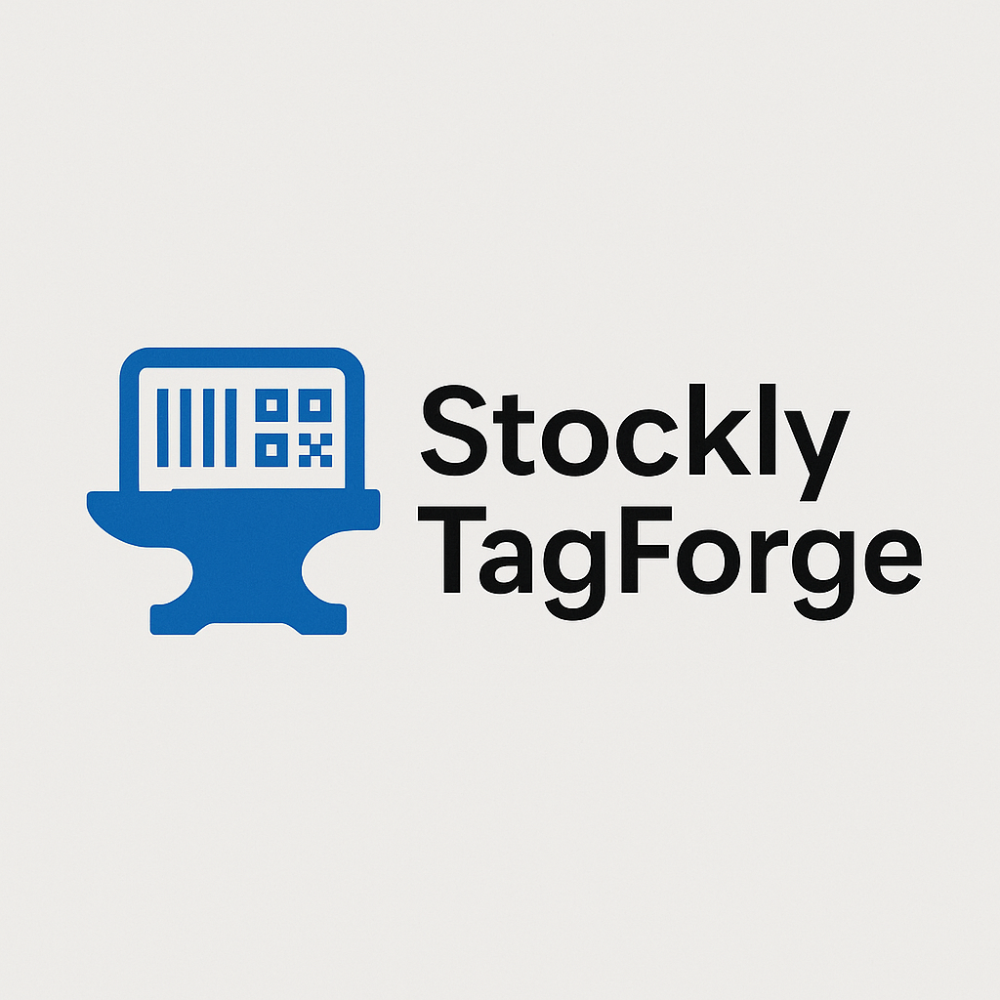

# StocklyTagForgeApp

**Desktop application** pour la génération et l'impression de QR codes destinés à l’application mobile Stockly.

---

## 🚀 Fonctionnalités principales

* **Génération de QR codes** à partir de données de stock (référence, désignation, lot)
* **Impression directe** des étiquettes QR via une imprimante configurée sur le système
* **Interface graphique conviviale** basée sur Qt (PyQt6) 

---

## ⚙️ Prérequis

* **Python 3.9+**
* **PyQt6**: interface graphique
* **qrcode** : génération de QR codes
* **Pillow** : manipulation d’images

---

## 📥 Installation

1. Clonez le dépôt :

   ```bash
   git clone https://github.com/Testeh69/StocklyTagForgeApp.git
   cd StocklyTagForgeApp
   ```
2. Créez et activez un environnement virtuel (optionnel mais recommandé) :

   ```bash
   python -m venv venv
   source venv/bin/activate     # macOS / Linux
   venv\\Scripts\\activate    # Windows
   ```
3. Installez les dépendances :

   ```bash
   pip install -r requirements.txt
   ```

---

## ▶️ Utilisation

1. Lancez l’application :

   ```bash
   python main.py
   ```


---

## 🔧 Personnalisation


* **assets/** : icônes et ressources graphiques

---

## 🛠️ Architecture

```
StocklyTagForgeApp/
├── main.py             # Point d'entrée de l'application
├── ui/                 # Fichiers UI (Qt Designer .ui)
|     ├── elements/
|     └── windows/
├── core/        # Logique métier, fonctions utilitaires
└── assets/             # Icônes et images
```

---

## 🤝 Contributions

Les contributions sont les bienvenues ! Merci de :

1. Forker ce dépôt
2. Créer une branche (`git checkout -b feature/ma-fonctionnalite`)
3. Committer vos changements (`git commit -m 'Ajout d\`une fonctionnalité'\`)
4. Pousser la branche (`git push origin feature/ma-fonctionnalite`)
5. Ouvrir une Pull Request

---

## 📄 Licence

Ce projet n'a pas de Licence.

### Remerciments:
   #### Pour les assets:
   - **@Dazzle UI**
   - **@Esri**

---

*StocklyTagForgeApp* – Simplifiez la gestion et l'étiquetage de votre stock avec des QR codes.
